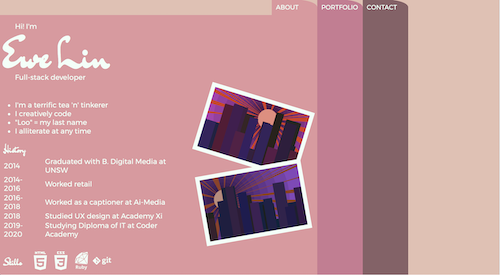
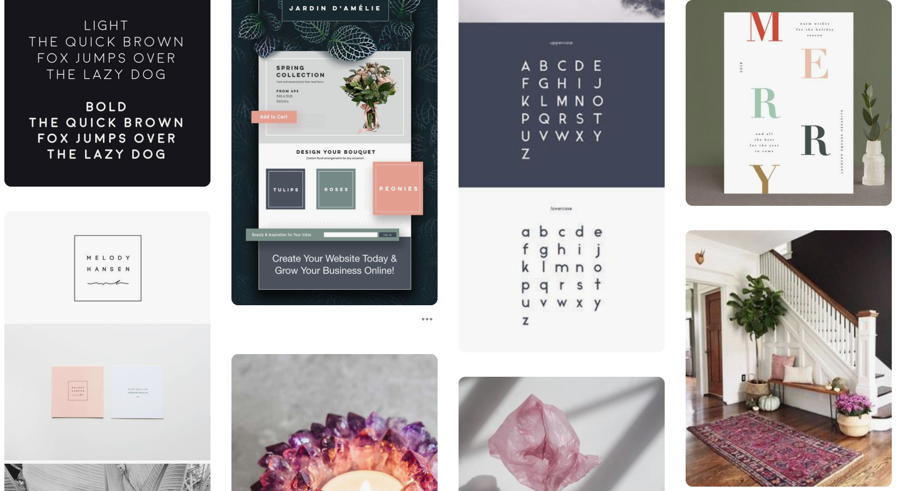

# My Portfolio

[Live portfolio](https://elloo.github.io/)

[Portfolio GitHub](https://github.com/elloo/portfolio)

This portfolio is a web page designed to showcase the full-stack web development skills of Ewe Lin Loo.

## Functionality / Features

- All artwork 100% handmade by Ewe Lin Loo
- Tabbed navbar emulates the aesthetic of physical folders
  - White borders around images imitate stickers on folders
- Desktop version has a z-index stacked layout
- Mobile version adapts to a continuous, flexbox layout
  - This prevents unnecessary scrolling back up to reach the nav

### Sitemap

This portfolio is contained entirely within one web page as seen in this [this](/docs/sitemap.xml) XML sitemap.

### Screenshots

#### Desktop

#### Tablet

#### Mobile

### Target Audience

This portfolio is intended for potential employers, recruiters and collaborators.

### Tech stack

This project was built with:

- HTML5
- CSS3
- JavaScript
- GitHub
- GitHub Pages

## Design Process

The first thing I did was start a Trello board that would be added to and editted throughout the design and coding processes. At the moment of writing, this is what it looks like:

I then went to Pinterest to start collecting inspirational images for my mood board. I kept my coded art at the back of my mind as I knew I wanted to use them as decorations.

 At the same time, I played around with the colour scheme generator at [coolors.co](coolors.co). The palette I ended up using was this one:

Once I had the mood board and colour scheme, I felt that a calligraphic script would bring character to the aesthetics of my portfolio. I relied on Google Fonts to suggest a sans serif font that I could pair it with. The calligraphic font I chose is called "Dr Sugiyama" whilst the sans serif font I chose is called "Montserrat".

I then came up with the idea of building a navigation system that relied on the JavaScript `onclick` function and z-index. [This](https://codepen.io/nyrnzn/pen/jVyZbE) CodePen showed me that what I had in mind was doable. I felt that this unique navigation would give my website design some originality.

### Wireframes

These original wireframes I came up with vary compared to the final product. 

In the "About" wireframes, the content has been reduced to a list rather than a paragraph of text. This should allow viewers to quickly scan the page and get an idea of my personality, rather than having them read through more dense text. The quote on the side has also been hidden behind the "About" section instead of showing on the side.

In the "Portfolio" wireframe, the orientation of the quote has been changed from horizontal to vertical so that it can be read normally. In addition, the navbar of the mobile version is not fixed to the top. 

In the "Contact" page, the contact form in the wireframe has been removed and replaced with a text version of my email address. The location of the social media buttons has also been moved to a more central location

### Usability Considerations

There were a few usability considerations to note:

1. The desktop layout and navigation would not be suitable for the tablet or mobile versions. This is because users are able to switch sections by clicking on the colour of that section. On mobile or tablet, they may accidentally tap on the coloured portion of a different section and switch  to that section. Additionally, this would make it more difficult for users to scroll down and up the page - particularly if they are right-handed.
2. The navbar is not fixed to the top of the screen. This is unnecessary as the desktop section has minimal vertical scrolling and using a mobile / tablet to scroll back up to the navigation is quick and easy.
3. The original contact form included in the wireframe has been removed from the final design. This is because the form would have relied on a `mailto` link, which would only work correctly if the user had adjusted the browser settings appropriately.
4. The social media icons on the tablet / mobile versions have been contained within the contact section rather than having them in a fixed position. This allows for more content space on smaller screens.

## Project plan & timeline

## Short Answer Questions

**Describe key events in the development of the internet from the 1980s to today (max. 150 words)**

**Define and describes the relationship between fundamental aspects of the internet such as: domains, web servers, DNS, and web browsers (max. 150 words)**

**Reflect on one aspect of the development of internet technologies and how it has contributed to the world today (max. 150 words)**